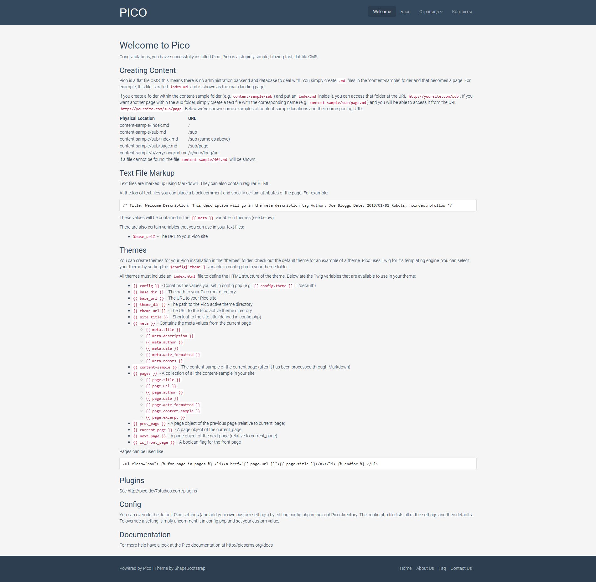
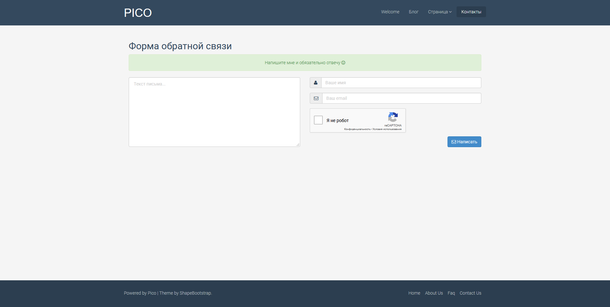
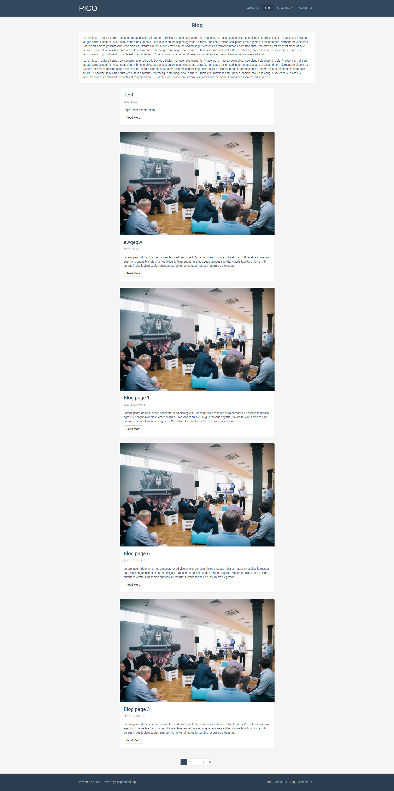
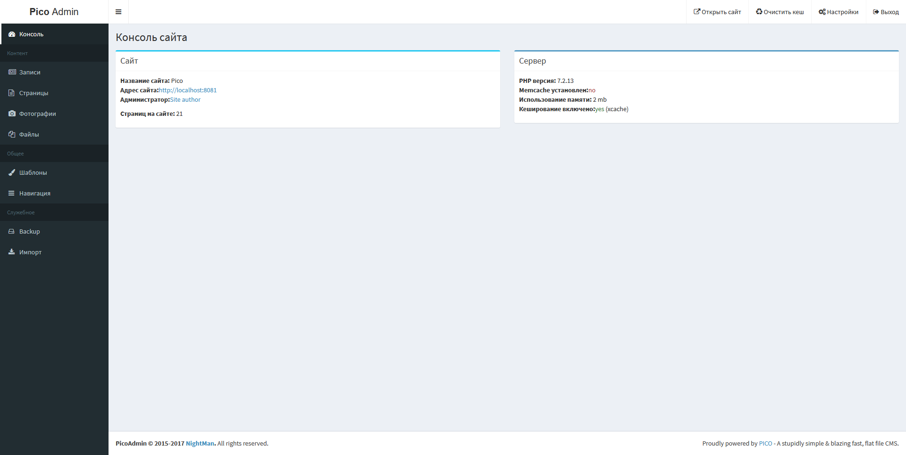
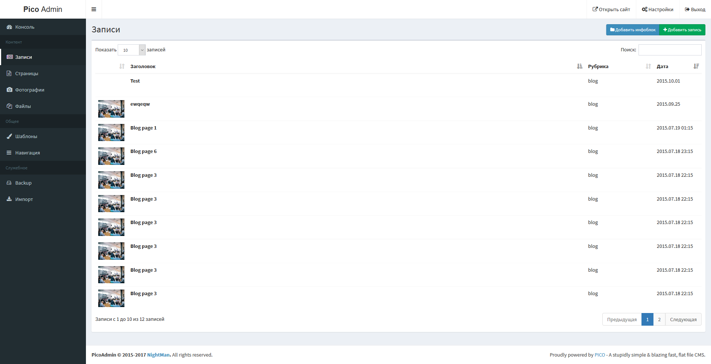
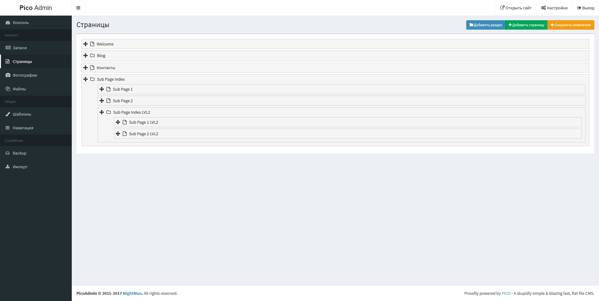
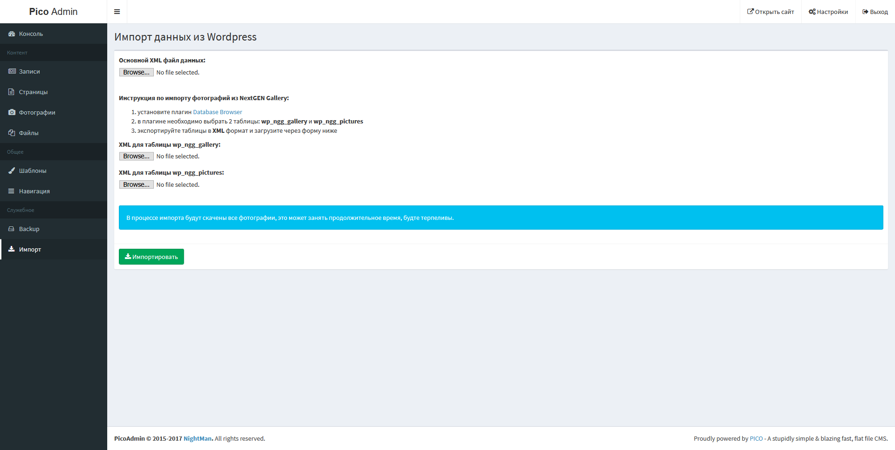
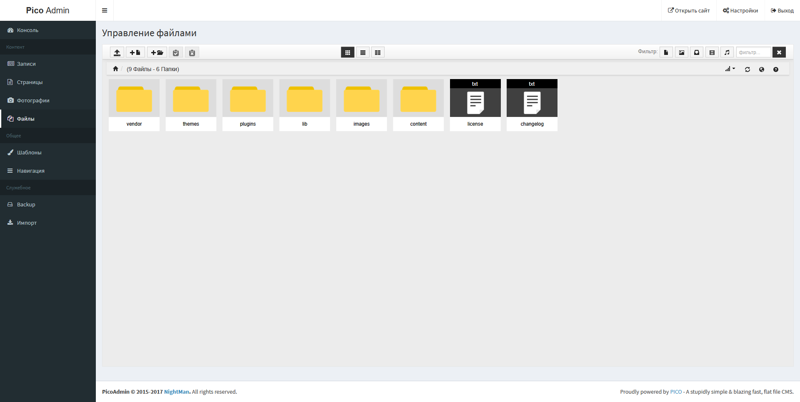

_*!!! Проект остановлен в 2017 году и больше не развивается !!!*_

## Добавленые фичи:
* Поддержка контента в HTML и MD формате
* 2х уровневое меню
* Инфоблоки для новостей, блога и подобных вещей
* Фильтрация по тегам в инфоблоке
* Добавлено кеширование через Xcache или Hoard (https://github.com/gilbitron/Hoard)
    * настройки в index.php
    * очистка кеша - /?flushcache=true
    * отключение через куку CACHE_ENABLE -> False
* Возможность назначать темплейт (и путь к нему) из плагинов, теперь не нужно переназначать 404 ошибку
* минимизация html (оптимизацию js и css лучше делать самостоятельно)
* конвертер markdown (md) в html
* Twig Extensions - http://twig.sensiolabs.org/doc/extensions/index.html
* Встроенная админка
* Импорт из Wordpress


### Дополнительные параметры:
* NavTitle (meta navtitle) - название для меню
* NavHidden (meta navhidden) - не показывать в меню, может принемать значание True
* NavOrder (meta navorder) - порядок сортировки меню
* ThumbSmall (meta thumbsmall) - маленькая картинка для списка постов в блоге
* ThumbBig (meta thumbbig) - большая картинка для внутренний страницв блога
* PageType (meta pagetype) - тип страницы
        : infoblock-index - список элементов инфоблока
        : infoblock-page - элемент инфоблока
* Gallery (meta gallery) - галерея картинок, размещать в /images/gallery/
* Tags (meta tegs) - теги для инфоблока, через запятую


## TODO:
* инфоблоки -> настройка количества новостей на странице
* админка -> настройки сайта
* админка -> галлерея
* контакты - проверить + языковые сообщения в отдельный файл
* админка -> инфоблоки
        3) картинки для префью
        5) теги
* backup -> поддержка долгого выполнения
* админка -> переименование файлов?!
* админка -> меню
* админка -> несколько пользователей с разными правами
* интегрировать infobox.php в pico.php
* папка без index == глюк (админка, список страниц)
* шаблон без theme.ini или кривой theme.ini (без описания шаблонов) == куча глюков при редактировании страниц

## TODO для версии NEXT:
* инфоблоки -> sqlite


### Напоминалки:
1) редироект (pico-redirect):
```/*
Title: Test Redirect to Homepage
Redirect: /
*/
```
2) pico_download - `<a href="{{ download_url }}/test.txt">Download test.txt</a>`
3) пароль по умолчанию - 1234567890


















